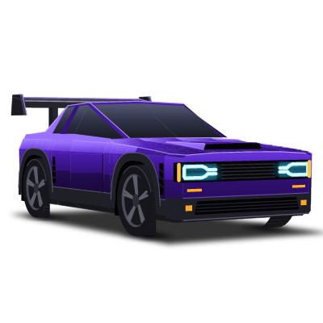
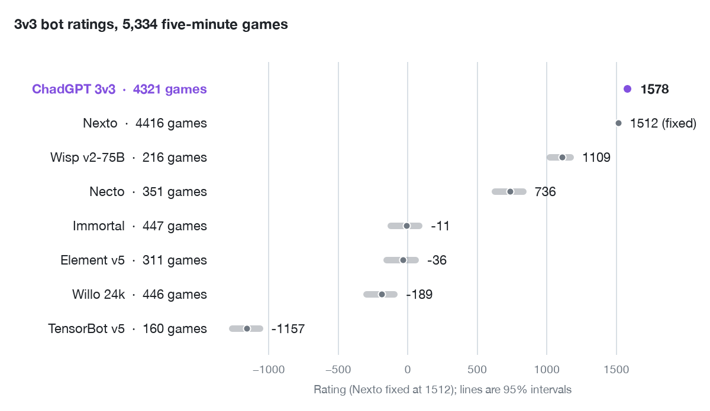

# ChadGPT

**ChadGPT 3v3** is a Rocket League bot for 3v3 soccar. One model to rule them all: a single neural network drives all three cars as one hivemind. By Cosmic Skye.

- **Training:** about 940 years of simulated 3v3 (about 8 million hours)
- **Steps:** more than 4.9 trillion (latest checkpoint, step 4,920,151,112,016)
- **Rating:** 1578, 66 above Nexto
- **Model:** 80,327,972 parameters, bfloat16 (161 MB)
- **Runs on:** [RLBot v5](https://rlbot.org), CPU or GPU

## Quick start

**Windows**

1. Download `ChadGPT-windows.zip` from [Releases](https://github.com/thecosmicskye/ChadGPT/releases).
2. Unzip, then either move the `ChadGPT` folder into your RLBot bot folder, or add it in the RLBot v5 GUI as a new bot folder.
3. Put "ChadGPT 3v3" on a team.

No Python needed. `ChadGPT\ChadGPT.exe --check` tests it without the game.

**From source** (GPU, Linux, macOS)

1. Clone the repository.
2. Run `python bootstrap.py --setup-only` (or `setup.cmd`).
3. Add this folder in RLBot.

## Rating

<picture>
  <source media="(prefers-color-scheme: dark)" srcset="docs/elo-dark.png">
  
</picture>

- 4,321 five-minute 3v3 games
- Against Nexto: 2,202 wins, 615 draws, 1,407 losses

## Architecture

| Block | Shape | Parameters |
|---|---|---|
| `shared_head` | 396 inputs, MLP 3712-3712 with LayerNorm | 15,271,168 |
| `policy` | 3712 inputs, MLP 3712-3712-7424 with LayerNorm, 1296 outputs | 64,783,120 |
| `relational_actor_attention` | 440 inputs, 128-128, 1300 outputs, 4 heads | 240,660 |
| `recurrent_memory` | 128 inputs, 192 outputs (matrix-free, hidden size 64) | 24,768 |
| `recurrent_candidate_delta` | 128 inputs, 64 outputs | 8,256 |
| **Total** | | **80,327,972** |

- **Policy:** PPO self-play in RocketSim; one network acts for all three cars, 30 decisions per second
- **Memory:** never reset; kept in `bot/memory/` across matches and restarts. It starts from a memory warmed up in play (`bot/memory/seed.npy`); delete `bot/memory/` to start from zero
- **Shadow arena:** RLBot reports no wheel or surface contact, so each packet is replayed for one tick in [RocketSim](https://github.com/ZealanL/RocketSim) to read them, as in training. This needs Rocket League's collision meshes, which are not included: on Windows the bot copies them from the running game on its first match (with [RLArenaCollisionDumper](https://github.com/ZealanL/RLArenaCollisionDumper)) and turns the arena on mid-match. Without them it plays on the packet's contacts

## Options (environment variables)

| variable | default | |
|---|---|---|
| `CHADGPT_DEVICE` | `auto` | `auto`, `cuda` or `cpu` |
| `CHADGPT_PRECISION` | `bf16` | `bf16` (as trained) or `fp32` |
| `CHADGPT_THREADS` | `auto` | CPU threads |
| `CHADGPT_PERSIST_MEMORY` | `1` | `0`: reset the memory every match |
| `CHADGPT_SHADOW_ARENA` | `auto` | `auto`: on when collision meshes are found or dumped; `0`: off; `1`: required (no meshes, no start) |
| `CHADGPT_COLLISION_MESHES` | `bot/collision_meshes` | folder holding `soccar/*.cmf` (RocketSim's layout); no dump is attempted when set |

## License

- Copyright © 2026 Cosmic Skye, under the [GNU AGPL v3.0](LICENSE) (runtime, weights and every file here except `third_party/`)
- `third_party/RLArenaCollisionDumper/RLArenaCollisionDumper.exe` is © ZealanL under the [MIT License](third_party/RLArenaCollisionDumper/LICENSE) and stays under it
- Trained with a modified fork of [GigaLearnCPP](https://github.com/ZealanL/GigaLearnCPP-Leak) on [RocketSim](https://github.com/ZealanL/RocketSim)
- Rocket League is a trademark of Psyonix; this project is not affiliated with or endorsed by Psyonix or Epic Games
